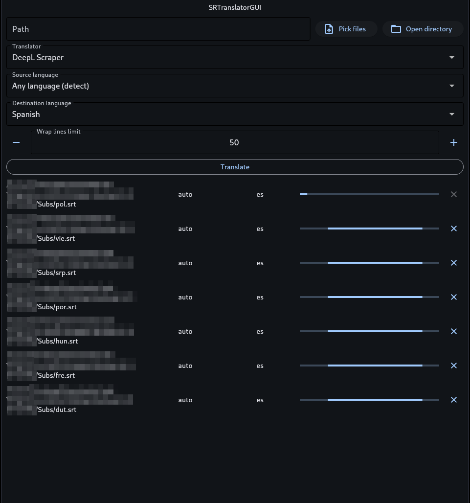

# SRTranslator

## Install

[PyPI](https://pypi.org/project/srtranslator/)

```bash
pip install srtranslator
```

## Usage in Blender

[tin2tin](https://github.com/tin2tin) has made this [blender addon](https://github.com/tin2tin/import_subtitles). Check it out.

## Usage from script

Import stuff

```python
import os

# SRT File
from srtranslator import SrtFile
# ASS File
from srtranslator import AssFile

from srtranslator.translators.deepl_api import DeeplApi
from srtranslator.translators.deepl_scrap import DeeplTranslator
from srtranslator.translators.translatepy import TranslatePy
from srtranslator.translators.pydeeplx import PyDeepLX
```

Initialize translator. It can be any translator, even your own, check the docs, there are instructions per translator and how to create your own.

```python
translator = DeeplTranslator() # or TranslatePy() or DeeplApi(api_key) or DeepLX()
```

Load, translate and save. For multiple recursive files in folder, check `examples folder`

```python
filepath = "./filepath/to/srt"

# SRT File
sub = SrtFile(filepath)
# ASS File
sub = AssFile(filepath)

# Translate
sub.translate(translator, "en", "es")

# Making the result subtitles prettier
sub.wrap_lines()

sub.save(f"{os.path.splitext(filepath)[0]}_translated.srt")
```

Quit translator

```python
translator.quit()
```

## Usage from GUI

Since release V0.3.9 there is a new GUI powered by flet (a python-flutter framework) on folder ./GUI



There is an artifact for linux and windows in the lastest github actions run.

#### Package from source

if you prefer to pack your own you could go to GUI folder, install the requirements and run `flet pack main.py` and copy assets folder

```
cd ./GUI
pip install -r requirements.txt
pip install pyinstaller
flet pack main.py
cp -r ./assets ./dist/assets
```

Binaries found in `dist` folder

#### Alternatives

[KryptoST](https://github.com/KryptoST) has made a graphical user interface. You can check it out [here](https://github.com/KryptoST/SRTranslatorGUI)

## Usage command line

```bash
# SRT file
python -m srtranslator ./filepath/to/srt -i SRC_LANG -o DEST_LANG

# ASS file
python -m srtranslator ./filepath/to/ass -i SRC_LANG -o DEST_LANG
```

## Advanced usage

```
usage: __main__.py [-h] [-i SRC_LANG] [-o DEST_LANG] [-v] [-vv] [-s] [-w WRAP_LIMIT] [-t {deepl-scrap,translatepy,deepl-api,pydeeplx}] [--auth AUTH] path

Translate an .STR and .ASS file

positional arguments:
  path                  File to translate

options:
  -h, --help            show this help message and exit
  -i SRC_LANG, --src-lang SRC_LANG
                        Source language. Default: auto
  -o DEST_LANG, --dest-lang DEST_LANG
                        Destination language. Default: es (spanish)
  -v, --verbose         Increase output verbosity
  -vv, --debug          Increase output verbosity for debugging
  -s, --show-browser    Show browser window
  -w WRAP_LIMIT, --wrap-limit WRAP_LIMIT
                        Number of characters -including spaces- to wrap a line of text. Default: 50
  -t {deepl-scrap,translatepy,deepl-api}, --translator {deepl-scrap,translatepy,deepl-api,pydeeplx}
                        Built-in translator to use
  --auth AUTH           Api key if needed on translator
  --proxies             Use proxy by default for pydeeplx
```
